<div align="center">

# 🛡️ Rapport d’analyse statique — UnCrackable-Level1.apk

### LAB 4 — Analyse statique d’un APK avec JADX GUI, dex2jar et JD-GUI  
**Cours : Sécurité des applications mobiles**

<br>


</div>

---

## 📌 Informations générales

| Élément | Détail |
|---|---|
| **Nom du lab** | LAB 4 — Analyse statique d’un APK |
| **APK analysé** | `UnCrackable-Level1.apk` |
| **Application** | UnCrackable1 |
| **Provenance** | OWASP MAS Crackmes — Android UnCrackable L1 |
| **Analyste** | Malak BELKHO |
| **Date d’analyse** | 30/05/2026 |
| **Taille de l’APK** | `65.09 KB` |
| **SHA-256** | `1DA8BF57D266109F9A07C01BF7111A1975CE01F190B9D914BCD3AE3DBEF96F21` |
| **Fichier DEX extrait** | `dex_out/classes.dex` |
| **Fichier JAR généré** | `results/UnCrackable-Level1.jar` |
| **Outils utilisés** | JADX GUI `v1.5.5`, dex2jar / dex-tools `v2.4`, JD-GUI `v1.6.6`, PowerShell |

---

## Résumé exécutif

L’analyse statique de l’application **UnCrackable-Level1.apk** a permis d’identifier plusieurs éléments intéressants liés à la sécurité mobile.

L’application ne demande aucune permission Android visible et ne contient pas d’endpoint réseau, de mot de passe ou de token directement exposé. Cependant, plusieurs éléments sensibles sont présents dans le code décompilé, notamment la logique de vérification du secret, des valeurs cryptographiques codées en dur, ainsi que des mécanismes anti-root et anti-debug facilement localisables.

Le niveau de risque global est évalué comme :

<div align="center">

## 🟠 Risque global : Moyen

</div>

Les risques identifiés sont principalement liés au contexte pédagogique du crackme. Dans une application réelle, ces pratiques devraient être évitées ou renforcées.

## Actions prioritaires recommandées

1. Désactiver `android:allowBackup` si l’application manipule des données sensibles.
2. Éviter le stockage de valeurs cryptographiques ou de secrets dans le code client.
3. Déplacer les vérifications critiques côté serveur.
4. Supprimer ou limiter les logs techniques en production.
5. Renforcer les protections anti-reverse engineering par plusieurs couches complémentaires.

---

## 🎯 Objectif du lab

L’objectif de ce laboratoire est de réaliser une **analyse statique complète** d’un APK Android autorisé, sans exécuter l’application.

Cette analyse couvre :

- la vérification de l’intégrité et de la structure interne de l’APK ;
- l’analyse du fichier `AndroidManifest.xml` ;
- l’exploration des ressources Android ;
- l’analyse du code Java décompilé avec **JADX GUI** ;
- la recherche de chaînes sensibles ;
- l’extraction du fichier `classes.dex` ;
- la conversion `DEX → JAR` avec **dex2jar** ;
- l’analyse alternative du JAR avec **JD-GUI** ;
- la comparaison entre JADX GUI et JD-GUI ;
- l’identification de constats de sécurité et la proposition de remédiations.

---

## 🧭 Méthodologie suivie

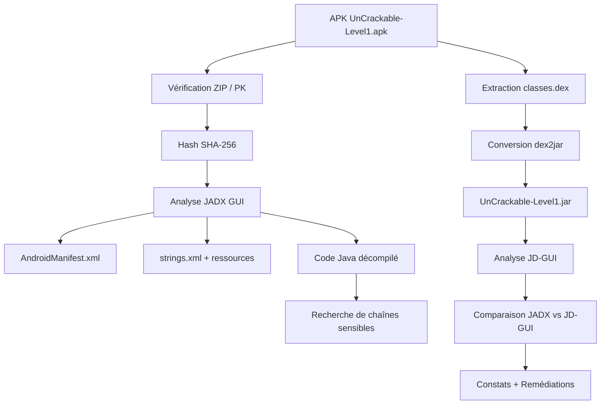
```mermaid
flowchart TD
    A[APK UnCrackable-Level1.apk] --> B[Vérification ZIP / PK]
    B --> C[Hash SHA-256]
    C --> D[Analyse JADX GUI]
    D --> E[AndroidManifest.xml]
    D --> F[strings.xml + ressources]
    D --> G[Code Java décompilé]
    G --> H[Recherche de chaînes sensibles]
    A --> I[Extraction classes.dex]
    I --> J[Conversion dex2jar]
    J --> K[UnCrackable-Level1.jar]
    K --> L[Analyse JD-GUI]
    L --> M[Comparaison JADX vs JD-GUI]
    M --> N[Constats + Remédiations]
```

---

# 1. Préparation du workspace et vérification de l’APK

## 1.1 Structure du dossier de travail

Le dossier de travail a été organisé de manière claire afin de séparer l’APK, les résultats, les fichiers extraits et les captures d’écran.

```text
LAB4_UnCrackable-Level1
│   notes_lab4.txt
│   UnCrackable-Level1.apk
│
├───dex_out
│       classes.dex
│
├───results
│       UnCrackable-Level1.jar
│
└───screenshots
        AndroidManifest.png
        apk_size.png
        convert_dex-jar.png
        dex_out_classes_dex.png
        Format-Hex.png
        Get-FileHash.png
        list_apk_files.png
        strings.png
        ...
```

---

## 1.2 Vérification du format APK

L’APK a été vérifié avec PowerShell afin de confirmer qu’il s’agit bien d’une archive ZIP valide.

```powershell
Get-Content -Path .\UnCrackable-Level1.apk -TotalCount 4 -Encoding Byte | Format-Hex
```

Résultat obtenu :

```text
50 4B 03 04    PK..
```

La signature `50 4B` correspond à `PK`, ce qui confirme que l’APK est bien une archive ZIP valide.

<p align="center">
  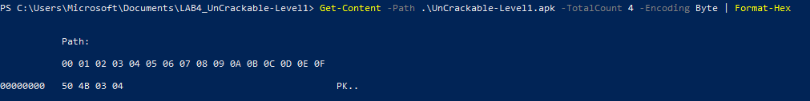
</p>

---

## 1.3 Liste du contenu de l’APK

La structure interne de l’APK contient les éléments essentiels d’une application Android.

```text
AndroidManifest.xml
META-INF/CERT.RSA
META-INF/CERT.SF
META-INF/MANIFEST.MF
classes.dex
res/layout/activity_main.xml
res/menu/menu_main.xml
res/mipmap-...
resources.arsc
```

<p align="center">
  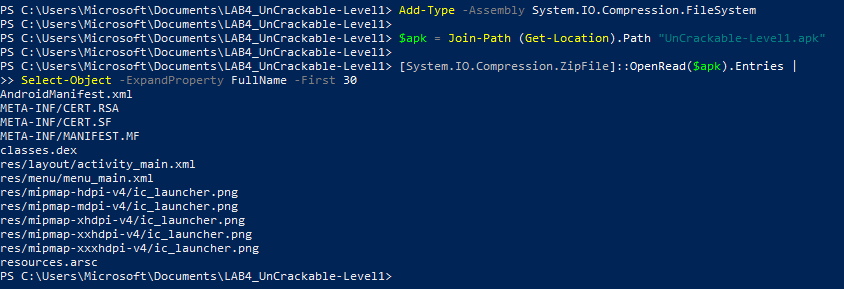
</p>

---

## 1.4 Hash SHA-256

Le hash SHA-256 a été calculé pour assurer la traçabilité de l’échantillon analysé.

```text
1DA8BF57D266109F9A07C01BF7111A1975CE01F190B9D914BCD3AE3DBEF96F21
```

<p align="center">
  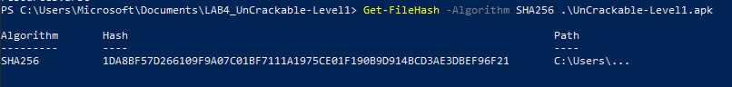
</p>

---

## 1.5 Taille de l’APK

La taille de l’APK est :

```text
65.09 KB
```

<p align="center">
  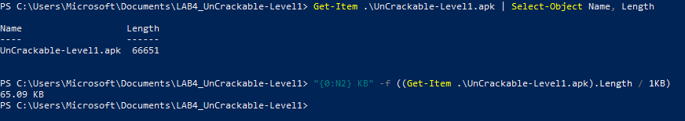
</p>

---

# 2. Analyse avec JADX GUI

## 2.1 Ouverture de l’APK dans JADX GUI

L’APK a été ouvert avec **JADX GUI**, ce qui permet d’explorer à la fois :

- le code Java décompilé ;
- les ressources Android ;
- le manifeste ;
- les fichiers XML ;
- les signatures APK.

<p align="center">
  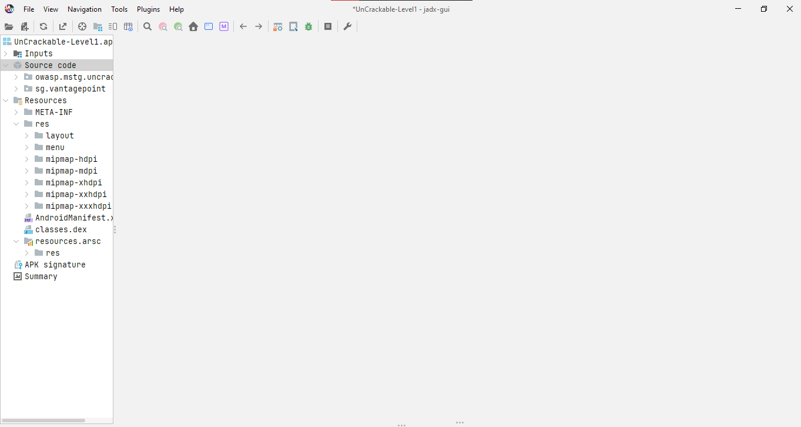
</p>

---

## 2.2 Analyse du fichier AndroidManifest.xml

Le fichier `AndroidManifest.xml` contient les informations principales de l’application.

```xml
<manifest
    android:versionCode="1"
    android:versionName="1.0"
    package="owasp.mstg.uncrackable1">

    <uses-sdk
        android:minSdkVersion="19"
        android:targetSdkVersion="28"/>

    <application
        android:theme="@style/AppTheme"
        android:label="@string/app_name"
        android:icon="@mipmap/ic_launcher"
        android:allowBackup="true">

        <activity
            android:label="@string/app_name"
            android:name="sg.vantagepoint.uncrackable1.MainActivity">

            <intent-filter>
                <action android:name="android.intent.action.MAIN"/>
                <category android:name="android.intent.category.LAUNCHER"/>
            </intent-filter>

        </activity>
    </application>
</manifest>
```

<p align="center">
  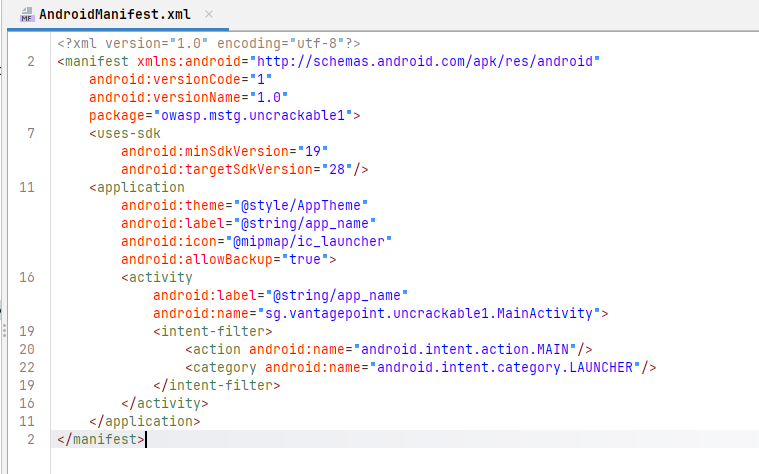
</p>

### Résumé du manifeste

| Élément | Valeur |
|---|---|
| **Package principal** | `owasp.mstg.uncrackable1` |
| **versionCode** | `1` |
| **versionName** | `1.0` |
| **minSdkVersion** | `19` |
| **targetSdkVersion** | `28` |
| **Activité principale** | `sg.vantagepoint.uncrackable1.MainActivity` |
| **Intent-filter** | `MAIN` / `LAUNCHER` |
| **Permissions** | Aucune permission visible |
| **Services** | Aucun |
| **Receivers** | Aucun |
| **Providers** | Aucun |
| **debuggable** | Non défini |
| **usesCleartextTraffic** | Non défini |
| **allowBackup** | `true` |

---

## 2.3 Analyse des ressources strings.xml

Le fichier `strings.xml` contient les chaînes visibles de l’application.

```xml
<resources>
    <string name="action_settings">Uncrackable1</string>
    <string name="app_name">Uncrackable1</string>
    <string name="button_verify">Verify</string>
    <string name="edit_text">Enter the Secret String</string>
    <string name="thanks">With special thanks to Bernhard Mueller...</string>
</resources>
```

<p align="center">
  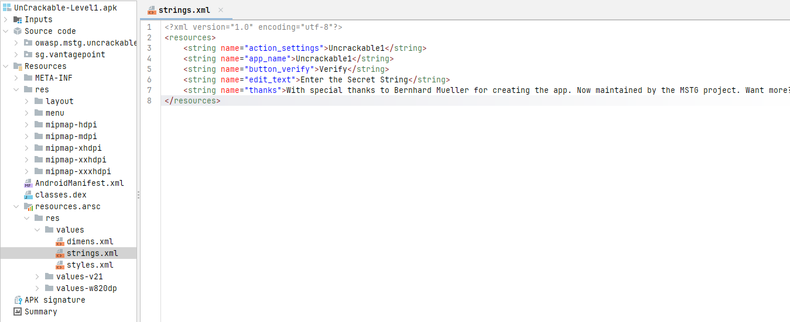
</p>

### Observation

Aucune URL, aucun token, aucun mot de passe et aucune clé API ne sont directement visibles dans `strings.xml`.

Cependant, les chaînes suivantes indiquent la fonctionnalité principale de l’application :

- `Enter the Secret String`
- `Verify`

---

# 3. Analyse du code décompilé avec JADX GUI

## 3.1 Classe principale MainActivity

La classe `sg.vantagepoint.uncrackable1.MainActivity` contient la logique principale de l’application.

<p align="center">
  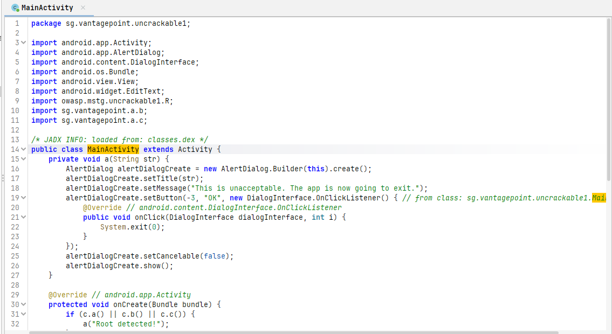
</p>

### Éléments observés

La méthode `onCreate()` effectue deux contrôles de sécurité :

```java
if (c.a() || c.b() || c.c()) {
    a("Root detected!");
}

if (b.a(getApplicationContext())) {
    a("App is debuggable!");
}
```

La méthode `verify(View view)` récupère la chaîne saisie par l’utilisateur et appelle la classe de vérification :

```java
if (a.a(string)) {
    alertDialogCreate.setTitle("Success!");
    str = "This is the correct secret.";
} else {
    alertDialogCreate.setTitle("Nope...");
    str = "That's not it. Try again.";
}
```

---

## 3.2 Classe de vérification du secret

La classe `sg.vantagepoint.uncrackable1.a` vérifie la chaîne saisie par l’utilisateur.

<p align="center">
  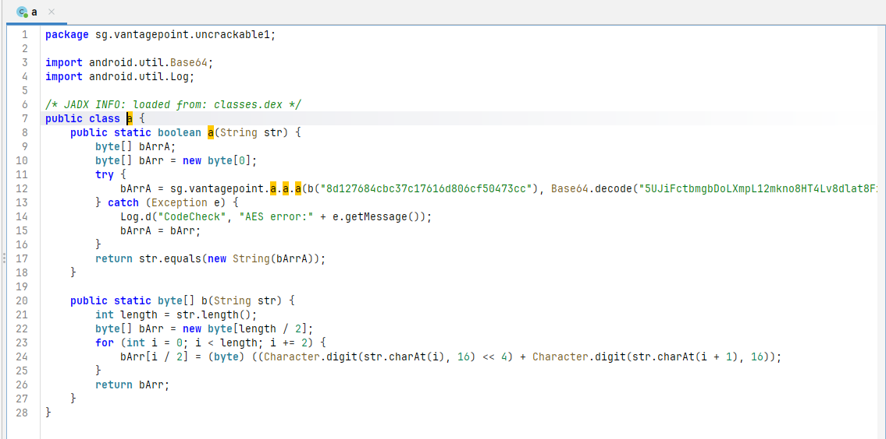
</p>

### Éléments sensibles observés

Deux valeurs sont codées en dur dans le code :

```text
8d127684cbc37c17616d806cf50473cc
```

```text
5UJiFctbmgbDoLXmpL12mkno8HT4Lv8dlat8FxR2GOc=
```

La classe utilise également une fonction AES :

```java
sg.vantagepoint.a.a.a(...)
```

et journalise une erreur technique :

```java
Log.d("CodeCheck", "AES error:" + e.getMessage());
```

---

## 3.3 Classe cryptographique sg.vantagepoint.a.a

La classe `sg.vantagepoint.a.a` contient la logique cryptographique.

<p align="center">
  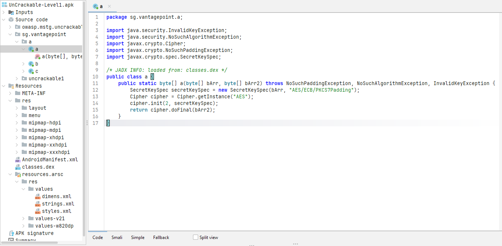
</p>

### Observation

La classe utilise :

- `SecretKeySpec`
- `Cipher`
- `AES`
- une opération de déchiffrement avec `cipher.init(2, secretKeySpec)`

Dans un contexte réel, le fait que la logique cryptographique soit visible facilite l’analyse statique et le reverse engineering.

---

## 3.4 Classe anti-debug sg.vantagepoint.a.b

La classe `sg.vantagepoint.a.b` vérifie si l’application est débogable.

<p align="center">
  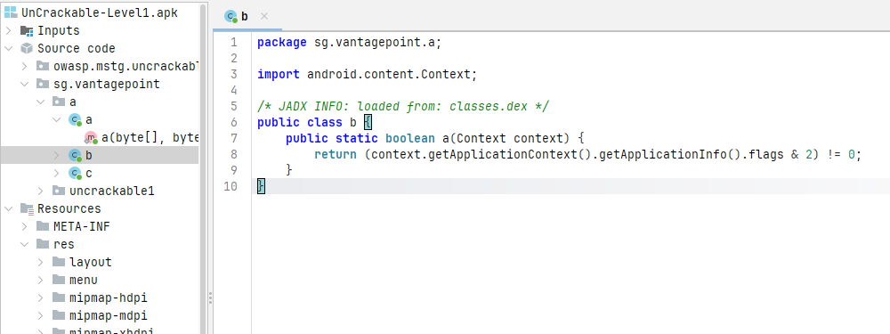
</p>

Code observé :

```java
(context.getApplicationContext().getApplicationInfo().flags & 2) != 0
```

Cette vérification correspond à l’identification du flag `FLAG_DEBUGGABLE`.

---

## 3.5 Classe anti-root sg.vantagepoint.a.c

La classe `sg.vantagepoint.a.c` contient plusieurs méthodes de détection root.

<p align="center">
  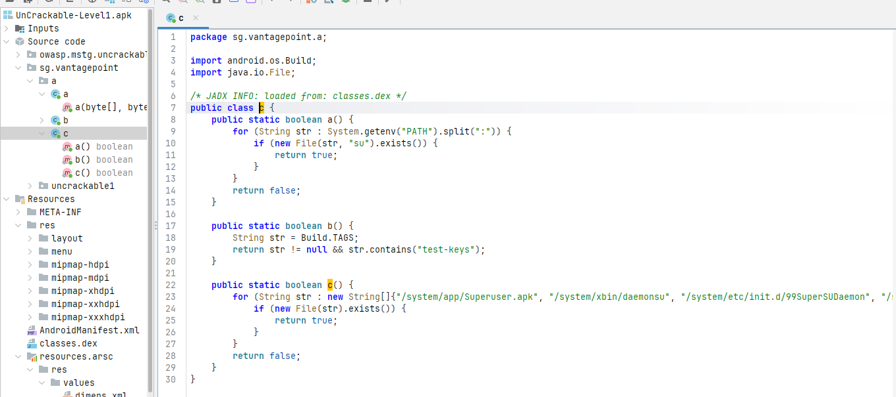
</p>

### Méthodes observées

| Méthode | Description |
|---|---|
| `a()` | Recherche le binaire `su` dans les chemins du `PATH` |
| `b()` | Vérifie si `Build.TAGS` contient `test-keys` |
| `c()` | Vérifie l’existence de chemins connus liés à Superuser / SuperSU |

Indicateurs recherchés :

```text
/system/app/Superuser.apk
/system/xbin/daemonsu
/system/etc/init.d/99SuperSUDaemon
/system/bin/.ext/.su
/system/etc/.has_su_daemon
/system/etc/.installed_su_daemon
/dev/com.koushikdutta.superuser.daemon/
```

---

# 4. Recherche de chaînes sensibles

Les recherches ont été effectuées dans JADX GUI avec les options suivantes activées :

- Class
- Method
- Field
- Code
- Resource
- Comments

<p align="center">
  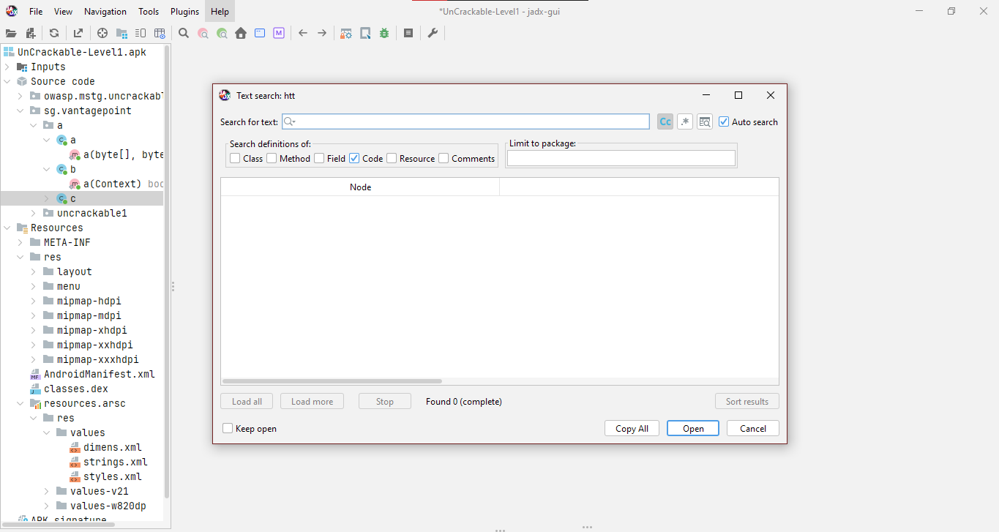
</p>

## 4.1 Synthèse des recherches

| Mot-clé | Résultat | Interprétation | Risque |
|---|---:|---|---|
| `http` | 3 | Namespace XML Android uniquement | Faible / RAS |
| `https` | 0 | Aucun endpoint HTTPS | Faible / RAS |
| `api` | 0 | Aucun endpoint API | Faible / RAS |
| `token` | 0 | Aucun token visible | Faible / RAS |
| `secret` | 5 | Chaînes et logique liées au secret | Moyen |
| `password` | 0 | Aucun mot de passe visible | Faible / RAS |
| `pwd` | 0 | Aucun mot de passe abrégé visible | Faible / RAS |
| `debug` | 1 | Message anti-debug visible | Moyen |
| `root` | 1 | Message anti-root visible | Moyen |
| `test` | 1 | Détection `test-keys` | Moyen |
| `check` | 2 | Log `CodeCheck` et chaîne `thanks` | Moyen |
| `verify` | 8 | Méthode de vérification localisable | Moyen |
| `AES` | 3 | Logique cryptographique visible | Moyen à élevé |
| `Base64` | 2 | Donnée Base64 codée en dur | Moyen |
| `.com` | 3 | Résultats liés uniquement au namespace Android `http://schemas.android.com/apk/res/android` | Faible / RAS |
| `.net` | 0 | Aucun domaine `.net` identifié | Faible / RAS |
| `.org` | 0 | Aucun domaine `.org` identifié | Faible / RAS |
| `.io` | 1 | Résultat lié à l’import Java standard `java.io.File`, sans lien avec un domaine réseau | Faible / RAS |
| `endpoint` | 0 | Aucun endpoint applicatif identifié | Faible / RAS |
| `url` | 0 | Aucune URL applicative trouvée | Faible / RAS |
| `server` | 0 | Aucun serveur ou endpoint backend visible | Faible / RAS |
| `api_key` | 0 | Aucune clé API visible | Faible / RAS |
| `apikey` | 0 | Aucune clé API visible sous forme alternative | Faible / RAS |
| `auth` | 0 | Aucun élément d’authentification visible | Faible / RAS |
| `bearer` | 0 | Aucun token Bearer identifié | Faible / RAS |
| `jwt` | 0 | Aucun jeton JWT identifié | Faible / RAS |
| `oauth` | 0 | Aucun mécanisme OAuth visible | Faible / RAS |
| `firebase` | 0 | Aucun service Firebase identifié | Faible / RAS |
| `crashlytics` | 0 | Aucun service Crashlytics identifié | Faible / RAS |

---

## 4.2 Captures des recherches importantes

### Recherche `secret`

<p align="center">
  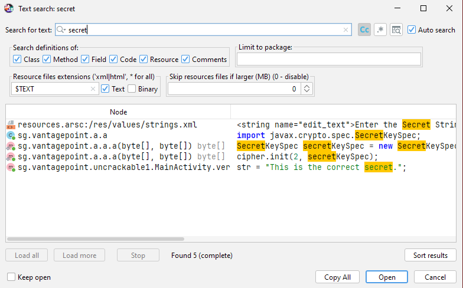
</p>

### Recherche `AES`

<p align="center">
  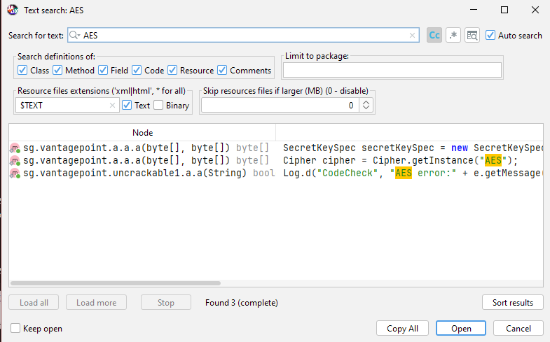
</p>

### Recherche `Base64`

<p align="center">
  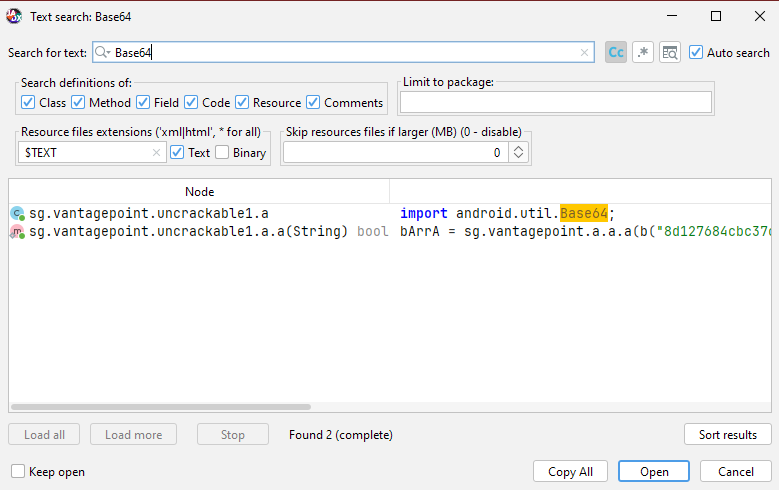
</p>

### Recherche `debug`

<p align="center">
  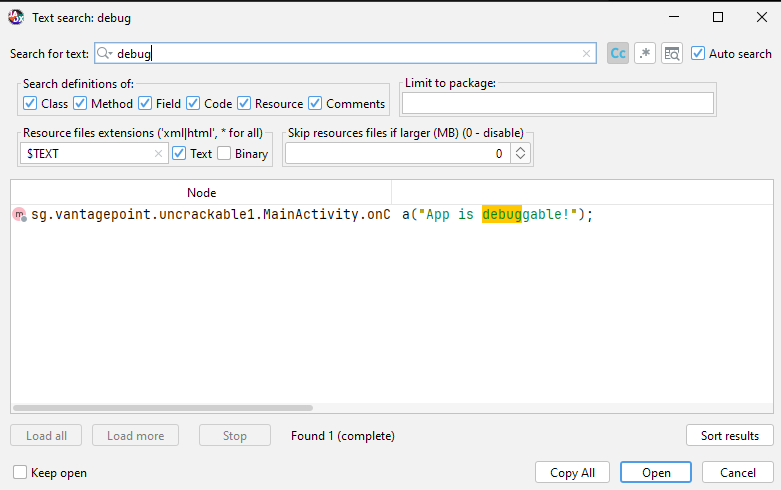
</p>

### Recherche `root`

<p align="center">
  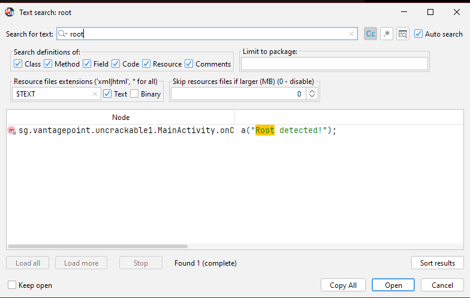
</p>

### Recherche `http`

Les résultats `http` correspondent uniquement au namespace Android :

```text
http://schemas.android.com/apk/res/android
```

Il ne s’agit pas d’une URL réseau utilisée par l’application.

<p align="center">
  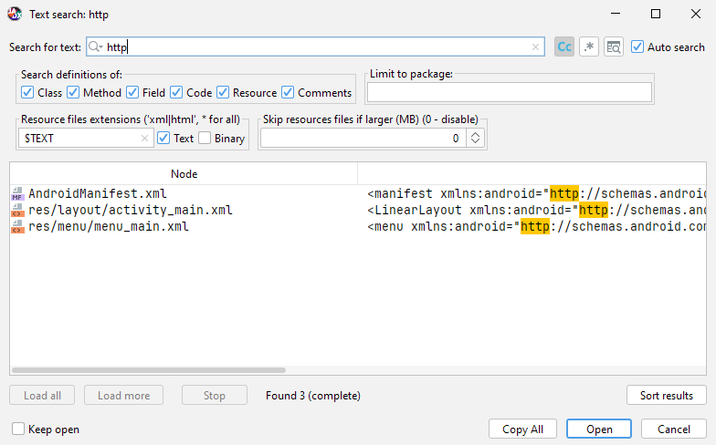
</p>

---

# 5. Conversion DEX vers JAR avec dex2jar

## 5.1 Extraction du fichier classes.dex

Le fichier `classes.dex` a été extrait depuis l’APK.

```text
dex_out/classes.dex
```

Taille :

```text
5528 bytes
```

<p align="center">
  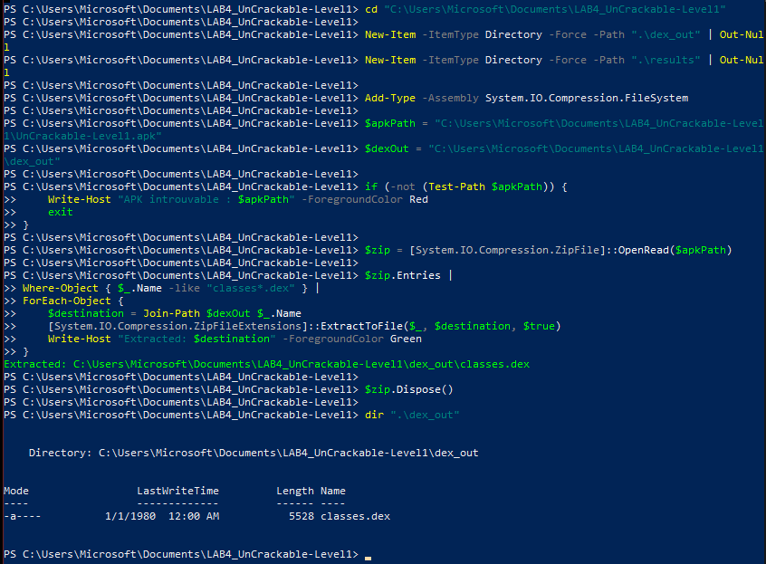
</p>

---

## 5.2 Conversion avec dex2jar

Commande utilisée :

```powershell
.\d2j-dex2jar.bat "C:\Users\Microsoft\Documents\LAB4_UnCrackable-Level1\dex_out\classes.dex" -o "C:\Users\Microsoft\Documents\LAB4_UnCrackable-Level1\results\UnCrackable-Level1.jar"
```

Résultat :

```text
dex2jar C:\Users\Microsoft\Documents\LAB4_UnCrackable-Level1\dex_out\classes.dex -> C:\Users\Microsoft\Documents\LAB4_UnCrackable-Level1\results\UnCrackable-Level1.jar
```

<p align="center">
  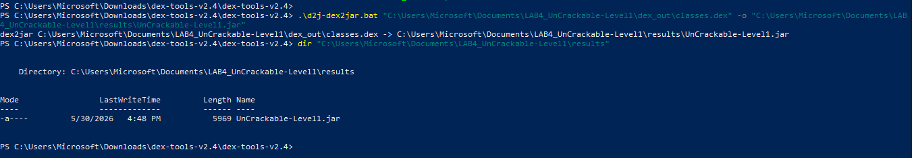
</p>

Le fichier généré est :

```text
results/UnCrackable-Level1.jar
```

Taille :

```text
5969 bytes
```

---

# 6. Analyse avec JD-GUI

## 6.1 Ouverture du JAR dans JD-GUI

Le fichier `UnCrackable-Level1.jar` généré par dex2jar a été ouvert avec **JD-GUI**.

<p align="center">
  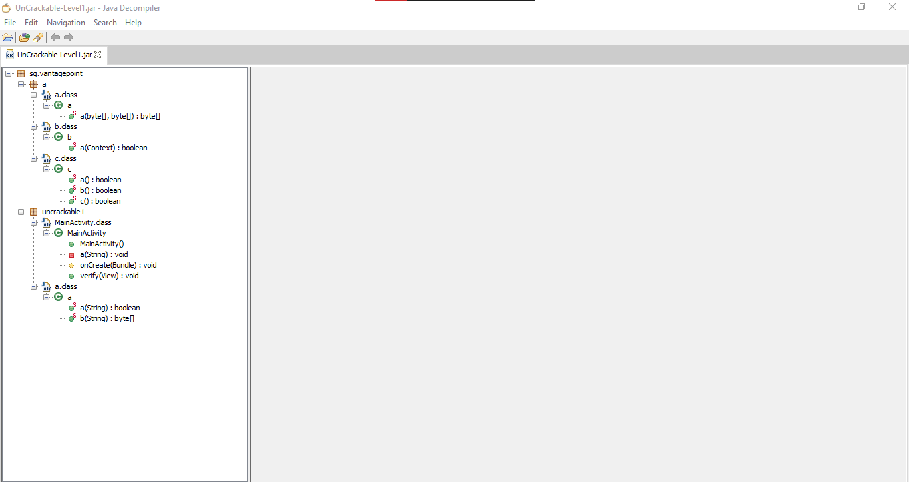
</p>

La structure Java reconstruite contient principalement :

```text
sg.vantagepoint.a
sg.vantagepoint.uncrackable1
```

---

## 6.2 MainActivity dans JD-GUI

<p align="center">
  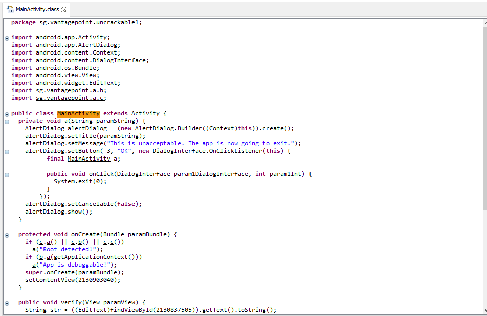
</p>

La classe `MainActivity` confirme les éléments déjà observés dans JADX :

- détection root ;
- détection debug ;
- méthode `verify(View paramView)` ;
- messages de succès ou d’échec ;
- appel à `a.a(str)` pour vérifier la chaîne saisie.

---

## 6.3 Classe de vérification dans JD-GUI

<p align="center">
  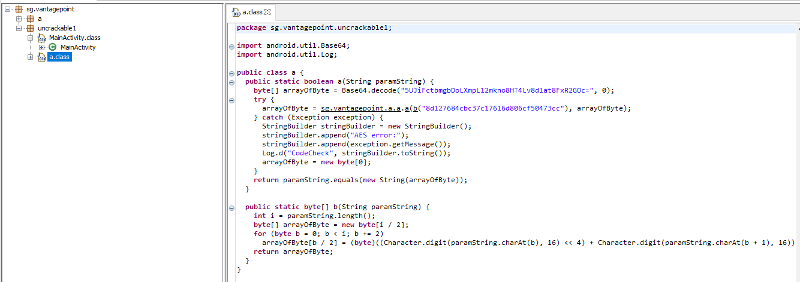
</p>

Cette classe confirme la présence :

- de la chaîne Base64 codée en dur ;
- de la valeur hexadécimale codée en dur ;
- de l’appel à la fonction AES ;
- du log technique `CodeCheck`.

---

## 6.4 Classe anti-root dans JD-GUI

<p align="center">
  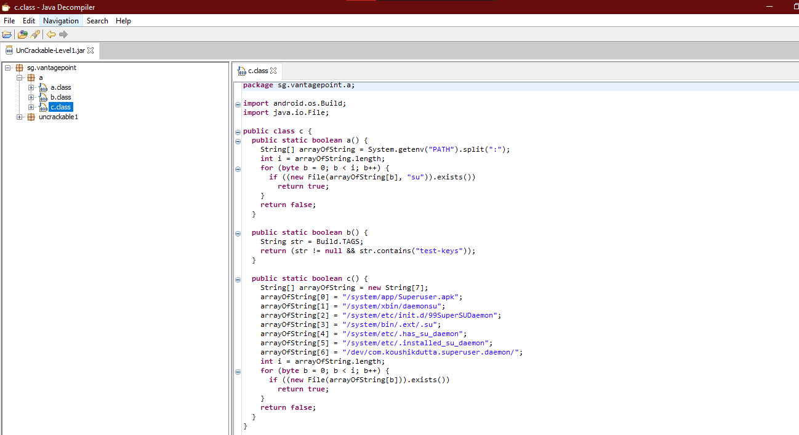
</p>

La classe `sg.vantagepoint.a.c` confirme les trois contrôles anti-root :

- recherche du binaire `su` ;
- vérification de `test-keys` ;
- recherche de fichiers liés à Superuser / SuperSU.

---

# 7. Comparaison JADX GUI vs JD-GUI

| Aspect | JADX GUI | JD-GUI |
|---|---|---|
| **Type de fichier ouvert** | APK directement | JAR généré avec dex2jar |
| **Manifest Android** | Visible et lisible | Non disponible directement |
| **Ressources Android** | `strings.xml`, layouts, menus, ressources | Non affichées directement |
| **Code Java** | Décompilé depuis l’APK / DEX | Décompilé depuis le JAR |
| **Navigation Android** | Très adaptée | Limitée au Java |
| **Références Android** | Plus lisibles : `R.layout`, `R.id` | Souvent numériques : `2130903040` |
| **Noms des paramètres** | Généralement plus lisibles | Souvent génériques : `paramString`, `paramView` |
| **Utilité principale** | Analyse statique Android complète | Vérification complémentaire du code Java |

## Conclusion de comparaison

**JADX GUI** est l’outil le plus adapté pour l’analyse statique d’un APK Android, car il permet d’observer à la fois le manifeste, les ressources et le code décompilé.

**JD-GUI** reste utile comme outil complémentaire afin de vérifier le code Java après conversion du DEX en JAR avec dex2jar.

---

# 8. Analyse des constats de sécurité

## 8.1 Légende de sévérité 🧨

| Indicateur | Niveau | Signification |
|---|---|---|
| 🟢 | Faible | Information non sensible, impact limité ou résultat RAS |
| 🟡 | Faible à moyenne | Point à surveiller selon le contexte |
| 🟠 | Moyenne | Risque exploitable dans certaines conditions |
| 🔴 | Élevée | Risque important dans une application réelle |
| ⚫ | Critique | Secret critique, compromission directe ou impact majeur |

--- 

## 8.2 Synthèse visuelle des constats

<div align="center">

| 🔎 Total constats | 🔴 Élevés | 🟠 Moyens | 🟡 Faible à moyen | 🟢 Faibles |
|---:|---:|---:|---:|---:|
| **7** | **2** | **4** | **1** | **0** |

</div>

| ID | Constat | Sévérité | Zone concernée |
|---|---|---|---|
| #1 | Sauvegarde applicative activée | 🟠 Moyenne | `AndroidManifest.xml` |
| #2 | Valeurs cryptographiques codées en dur | 🔴 Élevée | `sg.vantagepoint.uncrackable1.a` |
| #3 | Logique de vérification du secret visible | 🟠 Moyenne | `MainActivity.verify()` |
| #4 | Logs techniques liés à AES | 🟠 Moyenne | `Log.d("CodeCheck", ...)` |
| #5 | Mécanismes anti-root et anti-debug visibles | 🟠 Moyenne | `MainActivity`, `sg.vantagepoint.a.b/c` |
| #6 | Configuration AES implicite / absence d’IV visible | 🔴 Élevée | `sg.vantagepoint.a.a` |
| #7 | Versions SDK anciennes | 🟡 Faible à moyenne | `AndroidManifest.xml` |

---

# 9. Constats détaillés

## Constat #1 — Sauvegarde applicative activée 🟠

| Élément | Détail |
|---|---|
| **Sévérité** | 🟠 **Moyenne** |
| **Localisation** | `AndroidManifest.xml`, balise `<application>` |
| **Valeur observée** | `android:allowBackup="true"` |
| **Catégorie** | Configuration sensible |

### Description

L’attribut `android:allowBackup` est activé dans le manifeste. Dans une application réelle, cela peut représenter un risque si l’application stocke localement des données sensibles.

### Impact potentiel

Selon le contexte Android et la configuration de l’appareil, certaines données applicatives pourraient être incluses dans les mécanismes de sauvegarde, augmentant le risque d’exposition de données locales.

### Remédiation recommandée

Désactiver les sauvegardes si l’application manipule des données sensibles :

```xml
android:allowBackup="false"
```

---

## Constat #2 — Valeurs cryptographiques codées en dur 🔴

| Élément | Détail |
|---|---|
| **Sévérité** | 🔴 **Élevée dans un contexte réel** |
| **Localisation** | `sg.vantagepoint.uncrackable1.a.a(String)` |
| **Valeurs observées** | Valeur hexadécimale `8d127684cbc37c17616d806cf50473cc` et chaîne Base64 `5UJiFctbmgbDoLXmpL12mkno8HT4Lv8dlat8FxR2GOc=` |
| **Catégorie** | Secrets / cryptographie côté client |

### Description

Deux valeurs utilisées dans la logique de vérification sont présentes directement dans le code :

```text
8d127684cbc37c17616d806cf50473cc
```

```text
5UJiFctbmgbDoLXmpL12mkno8HT4Lv8dlat8FxR2GOc=
```

### Impact potentiel

Un analyste peut extraire ces valeurs avec une analyse statique et comprendre la logique de vérification. Dans une application réelle, cela faciliterait la récupération ou la reconstruction de secrets applicatifs.

### Remédiation recommandée

Éviter de stocker des secrets, clés, tokens ou valeurs sensibles directement dans le code client.  
Préférer :

- une vérification côté serveur ;
- Android Keystore pour les éléments cryptographiques locaux ;
- une rotation des clés ;
- une logique métier non dépendante de secrets embarqués dans l’APK.

---

## Constat #3 — Logique de vérification du secret visible 🟠

| Élément | Détail |
|---|---|
| **Sévérité** | 🟠 **Moyenne** |
| **Localisation** | `sg.vantagepoint.uncrackable1.MainActivity.verify()` et `sg.vantagepoint.uncrackable1.a` |
| **Valeurs observées** | Appel direct à `a.a(string)` pour comparer l’entrée utilisateur au secret attendu |
| **Catégorie** | Validation côté client / reverse engineering |

### Description

La méthode `verify(View view)` récupère la chaîne saisie et appelle directement la méthode de vérification :

```java
a.a(str)
```

La logique permettant de comparer l’entrée utilisateur avec la valeur attendue est donc localisable dans le code décompilé.

### Impact potentiel

Dans une application réelle, une logique de validation critique placée uniquement côté client peut être étudiée, modifiée ou contournée.

### Remédiation recommandée

Déplacer les contrôles sensibles côté serveur lorsque c’est possible.  
Côté client, utiliser plusieurs couches de protection :

- obfuscation ;
- validation côté serveur ;
- contrôle d’intégrité ;
- réduction des informations explicites dans les messages d’erreur.

---

## Constat #4 — Logs techniques liés à AES 🟠

| Élément | Détail |
|---|---|
| **Sévérité** | 🟠 **Moyenne** |
| **Localisation** | `sg.vantagepoint.uncrackable1.a.a(String)` |
| **Valeur observée** | `Log.d("CodeCheck", "AES error:" + e.getMessage())` |
| **Catégorie** | Journalisation / exposition d’informations techniques |

### Description

L’application journalise les erreurs liées au traitement AES. Les logs techniques peuvent révéler des informations internes utiles à l’analyse.

### Impact potentiel

Dans un environnement réel, les logs peuvent aider à comprendre les mécanismes internes, surtout si l’application expose des messages d’erreur trop détaillés.

### Remédiation recommandée

Éviter les logs détaillés en production.  
Utiliser des messages génériques ou conditionner les logs aux builds de développement uniquement.

---

## Constat #5 — Mécanismes anti-root et anti-debug visibles 🟠

| Élément | Détail |
|---|---|
| **Sévérité** | 🟠 **Moyenne** |
| **Localisation** | `MainActivity`, `sg.vantagepoint.a.b`, `sg.vantagepoint.a.c` |
| **Valeurs observées** | `Root detected!`, `App is debuggable!`, `su`, `test-keys` |
| **Catégorie** | Protection anti-reverse engineering |

### Description

L’application contient plusieurs mécanismes de détection :

- détection root ;
- détection debug ;
- recherche de `su` ;
- vérification de `test-keys` ;
- recherche de fichiers Superuser / SuperSU.

### Impact potentiel

Ces protections sont utiles, mais elles sont facilement localisables par analyse statique. Dans un contexte de reverse engineering, leur emplacement et leur logique peuvent être identifiés.

### Remédiation recommandée

Ne pas dépendre uniquement de contrôles anti-root ou anti-debug côté client.  
Renforcer la défense avec :

- obfuscation ;
- vérifications d’intégrité ;
- détection de hooks ;
- logique critique côté serveur ;
- contrôle d’environnement plus robuste.

---

## Constat #6 — Configuration AES implicite / absence d’IV visible 🔴

| Élément | Détail |
|---|---|
| **Sévérité** | 🔴 **Élevée dans un contexte réel** |
| **Localisation** | `sg.vantagepoint.a.a.a(byte[], byte[])` |
| **Valeurs observées** | Utilisation de `SecretKeySpec`, `Cipher.getInstance("AES")` et absence d’IV explicite visible dans le code analysé |
| **Catégorie** | Cryptographie / configuration de chiffrement |

### Description

La classe cryptographique utilise AES pour déchiffrer la valeur utilisée dans la vérification du secret. Le code décompilé montre une configuration AES implicite, sans IV explicite visible dans la méthode analysée.

### Impact potentiel

Dans une application réelle, une configuration cryptographique faible ou incomplète peut faciliter l’analyse du mécanisme de chiffrement, surtout lorsque les valeurs utilisées sont également codées en dur dans l’application.

### Remédiation recommandée

Utiliser un mode de chiffrement authentifié moderne comme `AES/GCM/NoPadding` avec un IV aléatoire et unique pour chaque opération. Les clés cryptographiques ne doivent pas être stockées directement dans le code client.

---

## Constat #7 — Versions SDK anciennes 🟡

| Élément | Détail |
|---|---|
| **Sévérité** | 🟡 **Faible à moyenne** |
| **Localisation** | `AndroidManifest.xml`, balise `<uses-sdk>` |
| **Valeurs observées** | `minSdkVersion="19"`, `targetSdkVersion="28"` |
| **Catégorie** | Compatibilité / durcissement Android |

### Description

L’application déclare une version minimale Android ancienne (`minSdkVersion=19`) et une version cible non récente (`targetSdkVersion=28`).

### Impact potentiel

Dans une application réelle, cibler d’anciennes versions Android peut empêcher l’application de bénéficier de certaines protections modernes introduites dans les versions récentes du système.

### Remédiation recommandée

Mettre à jour progressivement `targetSdkVersion` vers une version récente d’Android et éviter de supporter des versions trop anciennes si ce n’est pas nécessaire.

---

# 10. Points positifs observés

| Élément vérifié | Résultat |
|---|---|
| Permissions Android demandées | Aucune permission visible |
| Token d’accès | Non trouvé |
| Mot de passe codé en dur | Non trouvé |
| Endpoint API | Non trouvé |
| Endpoint HTTPS | Non trouvé |
| `android:debuggable="true"` | Non trouvé |
| `usesCleartextTraffic="true"` | Non trouvé |
| Services exposés | Aucun |
| Receivers exposés | Aucun |
| Providers exposés | Aucun |

---

# 11. Annexes

## 11.1 Permissions demandées

Aucune permission `uses-permission` n’a été identifiée dans le manifeste.

```text
Aucune permission demandée.
```

---

## 11.2 Composants Android déclarés

| Type | Composant | Export / exposition |
|---|---|---|
| Activity | `sg.vantagepoint.uncrackable1.MainActivity` | Accessible comme activité launcher via `MAIN` / `LAUNCHER` |
| Service | Aucun | N/A |
| Receiver | Aucun | N/A |
| Provider | Aucun | N/A |

---

## 11.3 Configuration sensible

| Élément | Valeur | Commentaire |
|---|---|---|
| `android:allowBackup` | `true` | Potentiel risque si données sensibles locales |
| `android:debuggable` | Non trouvé | Bon point |
| `usesCleartextTraffic` | Non trouvé | Bon point |
| `network_security_config.xml` | Non trouvé | Aucun fichier de configuration réseau spécifique identifié |
| `MAIN / LAUNCHER` | Présent | Normal pour l’activité principale |

---

## 11.4 Arborescence finale du projet

```text
LAB4_UnCrackable-Level1
│   notes_lab4.txt
│   UnCrackable-Level1.apk
│
├───dex_out
│       classes.dex
│
├───results
│       UnCrackable-Level1.jar
│
└───screenshots
        AndroidManifest.png
        apk_size.png
        convert_dex-jar.png
        dex_out_classes_dex.png
        Format-Hex.png
        Get-FileHash.png
        global_search.png
        JADX-GUI_Global-View-File-Tree_UnCrackable-Level1.png
        JD-GUI-Global-View-File-Tree_UnCrackable-Level1-jar.png
        search_AES.png
        search_Base64.png
        search_debug.png
        search_root.png
        search_secret.png
        strings.png
        ...
```

---

# 12. Ressources utilisées

- OWASP MAS Crackmes — Android UnCrackable L1  
  https://mas.owasp.org/crackmes/

- JADX — Dex to Java decompiler  
  https://github.com/skylot/jadx

- dex2jar — Tools to work with Android `.dex` files  
  https://github.com/pxb1988/dex2jar

- JD-GUI — Java Decompiler GUI  
  https://github.com/java-decompiler/jd-gui

- OWASP MASVS — Mobile Application Security Verification Standard  
  https://mas.owasp.org/MASVS/
  
---

# 13. Périmètre et limites de l’analyse

Cette analyse est strictement statique. L’application n’a pas été modifiée ni exploitée.  
Les observations reposent sur le contenu décompilé avec JADX GUI et JD-GUI, ainsi que sur l’extraction du bytecode avec dex2jar.

Limites :
- aucune exécution dynamique de l’application ;
- aucune instrumentation avec Frida ou outil similaire ;
- aucune exploitation active des mécanismes anti-root ou anti-debug ;
- analyse réalisée uniquement sur un APK pédagogique autorisé.

---

# 14. Checklist de conformité avec l’énoncé du lab

## 14.1 Tâches techniques

| Tâche demandée | Exigence de l’énoncé | Réalisation | Statut |
|---|---|---|---|
| Task 1 | Créer un workspace | Dossier `LAB4_UnCrackable-Level1` organisé | ✅ Terminé |
| Task 1 | Vérifier que l’APK est une archive ZIP | Magic bytes `50 4B / PK` vérifiés | ✅ Terminé |
| Task 1 | Lister le contenu de l’APK | `AndroidManifest.xml`, `classes.dex`, `res/`, `META-INF/` identifiés | ✅ Terminé |
| Task 1 | Calculer le SHA-256 | Hash SHA-256 documenté | ✅ Terminé |
| Task 2 | Documenter la provenance | OWASP MAS Crackmes — Android UnCrackable L1 | ✅ Terminé |
| Task 2 | Noter la taille de l’APK | `65.09 KB` | ✅ Terminé |
| Task 3 | Ouvrir l’APK dans JADX GUI | APK chargé et arborescence explorée | ✅ Terminé |
| Task 3 | Analyser `AndroidManifest.xml` | Package, SDK, activité, permissions, configurations sensibles | ✅ Terminé |
| Task 3 | Explorer les ressources | `strings.xml` analysé | ✅ Terminé |
| Task 4 | Rechercher les chaînes sensibles | `http`, `https`, `.com`, `.net`, `.org`, `.io`, `api`, `token`, `secret`, `password`, `debug`, `root`, `AES`, `Base64`, `endpoint`, `url`, `server`, `api_key`, `apikey`, `auth`, `bearer`, `jwt`, `oauth`, `firebase`, `crashlytics`, etc. | ✅ Terminé |
| Task 4 | Documenter au moins 5 observations | 29 recherches/patterns documentés + observations principales | ✅ Terminé |
| Task 5 | Convertir DEX vers JAR | `results/UnCrackable-Level1.jar` généré | ✅ Terminé |
| Task 6 | Ouvrir le JAR dans JD-GUI | JAR ouvert et classes analysées | ✅ Terminé |
| Task 6 | Comparer JADX GUI et JD-GUI | Tableau comparatif ajouté | ✅ Terminé |
| Task 7 | Rédiger le rapport final | `README.md` + rapport Markdown | ✅ Terminé |
| Task 8 | Organiser les fichiers | `screenshots/`, `dex_out/`, `results/` | ✅ Terminé |

## 14.2 Livrables demandés

| Livrable demandé | Élément fourni | Statut |
|---|---|---|
| Mini-rapport d’analyse | `README.md` / rapport Markdown | ✅ Fourni |
| Liste des permissions | Section Annexes — permissions demandées | ✅ Fourni |
| Liste des composants exposés | Section Annexes — composants Android déclarés | ✅ Fourni |
| Au moins 3 constats de sécurité | 7 constats documentés | ✅ Fourni |
| Remédiations proposées | Une remédiation par constat | ✅ Fourni |
| Captures d’écran critiques | Dossier `screenshots/` | ✅ Fourni |
| JAR généré pour analyse JD-GUI | `results/UnCrackable-Level1.jar` | ✅ Fourni |
| Comparaison JADX / JD-GUI | Section dédiée | ✅ Fourni |

## 14.3 Éléments optionnels

| Élément optionnel | Statut | Commentaire |
|---|---|---|
| Vérification de signature APK | Non réalisée | Optionnelle dans l’énoncé |
| Suppression de l’APK après analyse | Non réalisée | APK pédagogique OWASP conservé pour traçabilité |
| Suppression de `dex_out` | Non réalisée | Conservé pour preuve technique |

---

# 15. Clôture de l’audit

| Point de contrôle final | Résultat |
|---|---|
| Données réelles exposées dans le rapport | Aucune donnée réelle détectée |
| APK analysé | APK pédagogique OWASP autorisé |
| Exploitation active | Non réalisée |
| Analyse dynamique | Non réalisée |
| Modification de l’APK | Non réalisée |
| Artefacts organisés | Oui |
| Captures disponibles | Oui |
| Rapport prêt pour dépôt GitHub | Oui |

> Cette analyse respecte le périmètre pédagogique du lab : analyse statique uniquement, sans exploitation active ni utilisation d’application tierce non autorisée.

---

<div align="center">
    
## ✅ Conclusion finale

Cette analyse statique a permis de comprendre la structure interne de l’APK **UnCrackable-Level1**, d’identifier les composants Android déclarés, d’analyser la logique de sécurité visible dans le code décompilé, puis de comparer deux approches de décompilation : **JADX GUI** et **JD-GUI**.

Le lab est entièrement réalisé et les livrables demandés sont prêts.

</div>
